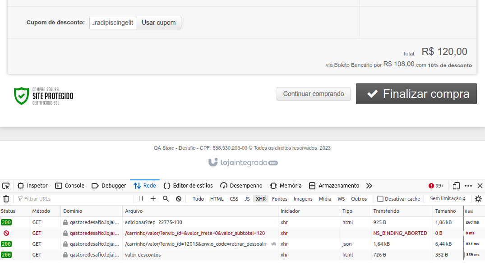
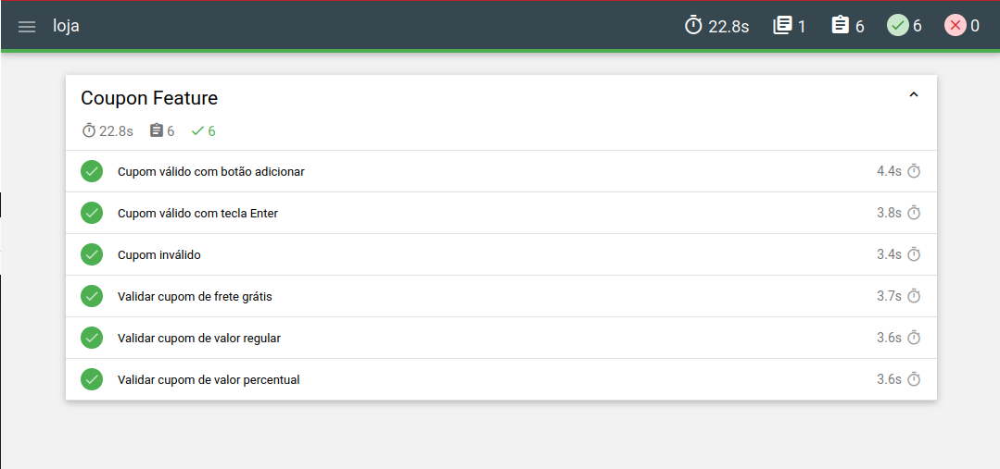

# loja

### :ticket: Feature Cupom

## :writing_hand: Documentação de negócio e testes

:page_facing_up: **Descrição:**

Uma funcionalidade nova está sendo incluída no carrinho de compras da LI. Um cupom que pode dar diferentes tipos de descontos como: frete grátis, desconto percentual, desconto regular etc.
No front-end ele será apresentado na forma de um campo de texto com label **Cupom de desconto:** e um botão para aplicar o cupom, com label **Usar cupom**.

:monocle_face: **Regras de negócio:**

- Cupom não é um campo obrigatório.
- Apenas um cupom pode ser aplicado por carrinho.
- Para aplicar o cupom preenchido no botão "Usar cupom" ou pressionando Enter no teclado.
- Ao tentar aplicar um cupom não existente, o campo deve ser limpo (voltar à condição anterior) e exibir a seguinte mensagem de erro: _"Cupom não encontrado."_
- Ao tentar aplicar um cupom expirado, o campo deve ser limpo (voltar à condição anterior) e exibir a seguinte mensagem de erro: _"O cupom não é válido."_
- Um cupom não aumenta valor do carrinho.
- Ao aplicar um cupom válido, tanto o campo quanto o botão do cupom deixam de ser exibidos, o texto do cupom inserido é exibido no carrinho e uma opção para remover o cupom é exibida ao lado.
- Ao aplicar um cupom válido, o carrinho deve ser atualizado para o contexto de desconto aplicado, mostrar qual o tipo de desconto aplicado e atualizar valor total do carrinho.
- Ao remover um cupom aplicado, tanto o campo quanto o botão do cupom voltam a ser exibidos, com o campo limpo, e o texto do cupom inserido anteriormente assim como opção para remover o cupom deixam de ser exibidos.
- Ao remover um cupom aplicado, o carrinho deve ser atualizado para o contexto anterior à aplicação do cupom.
- O fechamento de compras não deve ser afetado.

### :ballot_box_with_check: Critérios de aceitação

- Permitir o uso de cupom no carrinho.
- Permitir remoção do cupom no carrinho.
- Nenhum débito técnico deve ser incluído nessa funcionalide, ou seja, devem ser entregues testes automatizados em todas as camadas:

  - Testes de unidade pelos desenvolvedores (e testadores).
  - Testes de integração pelos desenvolvedores e/ou testadores.
  - Testes end-to-end pelos testadores.

- Avaliar com o time a necessidade de um teste de performance na aplicação para comportar a feature de Cupom.
- O fechamento de compras não deve ser afetado, e permitir a compra com ou sem cupom aplicado no carrinho.

### :test_tube: Cenários de teste em BDD

Nesse trecho serão escritos os cenários de teste que validarão os requisitos propostos na nova funcionalidade, usando uma linguagem natural para melhor entendimento do time.

Obs.: Esses não são todos cenários de testes possíveis, apenas uma amostra.

| CT-01  | Aplicar cupom válido clicando no botão usar cupom                  |
| ------ | ------------------------------------------------------------------ |
| Dado   | que estou no carrinho com um produto adicionado                    |
| Quando | aplico um cupom **válido**                                         |
| Então  | o texto do cupom é exibido "aplicado" e exibe uma opção de remover |
| E      | o desconto deve ser exibido no carrinho                            |

| CT-02  | Aplicar cupom válido clicando no botão "Enter" do teclado          |
| ------ | ------------------------------------------------------------------ |
| Dado   | que estou no carrinho com um produto adicionado                    |
| Quando | aplico um cupom **válido**                                         |
| Então  | o texto do cupom é exibido "aplicado" e exibe uma opção de remover |
| E      | o desconto deve ser exibido no carrinho                            |

| CT-03  | Remover cupom aplicado                                                    |
| ------ | ------------------------------------------------------------------------- |
| Dado   | que estou no carrinho com um cupom aplicado                               |
| Quando | seleciono a opção de remover o cupom                                      |
| Então  | o cupom é removido voltando a exibir os campos de cupom                   |
| E      | o desconto deve ser removido do carrinho voltando às condições anteriores |

| CT-04  | Aplicar cupom inválido/não existente                           |
| ------ | -------------------------------------------------------------- |
| Dado   | que estou no carrinho com um produto adicionado                |
| Quando | tento aplicar um cupom **inválido**                            |
| Então  | o campo do cupom é limpo voltando à condição anterior          |
| E      | a mensagem de erro deve ser exibida: _"Cupom não encontrado."_ |

| CT-05  | Aplicar cupom expirado                                         |
| ------ | -------------------------------------------------------------- |
| Dado   | que estou no carrinho com um produto adicionado                |
| Quando | tento aplicar um cupom **expirado**                            |
| Então  | o campo do cupom é limpo voltando à condição anterior          |
| E      | a mensagem de erro deve ser exibida: _"O cupom não é válido."_ |

| CT-06  | Aplicar cupom de frete grátis                                  |
| ------ | -------------------------------------------------------------- |
| Dado   | que estou no carrinho com um produto adicionado                |
| Quando | aplico um cupom **válido** de **frete grátis**                 |
| Então  | no campo ao lado do cupom é exibido o termo **"Frete grátis"** |
| E      | o valor do frete é removido do carrinho                        |

| CT-07  | Aplicar cupom de desconto percentual                                                |
| ------ | ----------------------------------------------------------------------------------- |
| Dado   | que estou no carrinho com um produto adicionado                                     |
| Quando | aplico um cupom **válido** de **desconto percentual**                               |
| Então  | no campo ao lado do cupom é exibido o termo **"Desconto: X % (frete não incluso)"** |
| E      | o valor do desconto é aplicado no total do carrinho                                 |

| CT-08  | Aplicar cupom de desconto regular (Ex.: R$10,00, R$50,00)                            |
| ------ | ------------------------------------------------------------------------------------ |
| Dado   | que estou no carrinho com um produto adicionado                                      |
| Quando | aplico um cupom **válido** de **desconto regular**                                   |
| Então  | no campo ao lado do cupom é exibido o termo **"Desconto: R$ X (frete não incluso)"** |
| E      | o valor do desconto é aplicado no total do carrinho                                  |

| CT-09  | Fechar compra com cupom aplicado                                                  |
| ------ | --------------------------------------------------------------------------------- |
| Dado   | que estou no carrinho com um cupom (regular / percentual / frete grátis) aplicado |
| Quando | finalizo a compra                                                                 |
| Então  | o valor / percentual / frete grátis devem permanecer no fechamento de compra      |

| CT-10  | Fechar compra sem cupom aplicado                      |
| ------ | ----------------------------------------------------- |
| Dado   | que estou no carrinho sem um cupom aplicado           |
| Quando | finalizo a compra                                     |
| Então  | o valor total deve permanecer no fechamento de compra |

### :robot: Projeto de testes end-to-end

Conforme orientação do critério de aceitação, foi definido um projeto de testes _end-to-end_ que comporta alguns dos requisitos propostos.
Foi escrito usando o framework **Cypress** com **Javascript**, usando o padrão de projeto de testes automatizados **Page Objects**, assim permitindo a expansão do projeto de forma limpa e organizada pelo time.

Obs1: Não foi coberta a camada de API, mesmo com o framework suportanto, dado o tempo para entrega do desafio.

Obs2: O escopo dos testes ficou apenas no carrinho, não atendendo aos critérios de fechamento de compra, dado o mesmo motivo acima.

### :scroll: Relatório de testes

A execução dos testes manuais, mesmo executando testes exploratórios além do planejamento de testes não detectou nenhum problema, dados os requisitos técnicos e de negócio. Porém podemos simular um _"bug report"_ de erro para um cenário não especificado:

---

#### Descrição do problema

O campo "cupom" não limita o preenchimento em "30" caracteres, permitindo que o usuário final insira um cupom com quantidade superior à 30 e uma requisição ao _backend_ é feita de forma desnecessária.

#### Passos para reproduzir o problema

1. Estar no carrinho de compras.
1. Adicionar o cupom "Loremipsumdolorsitametconsecteturadipiscingelit"
1. Clicar em "Usar cupom"

#### Resultado esperado

1. O campo não deve permitir incluir mais de 30 caracteres

#### Resultado atual

1. O campo permite incluir mais de 30 caracteres
1. Faz uma requisição ao "backend" para validar o cupom

#### Evidências

---

Quanto ao relatório de testes automatizados, foi utilizada uma biblioteca do mocha chamada **mochawesome** para gerar um relatório em HTML. Uma amostra do resultado:

Para ter acesso aos HTML gerado completo basta clonar o projeto e acessar o .html na pasta **./mochawesome-report**
